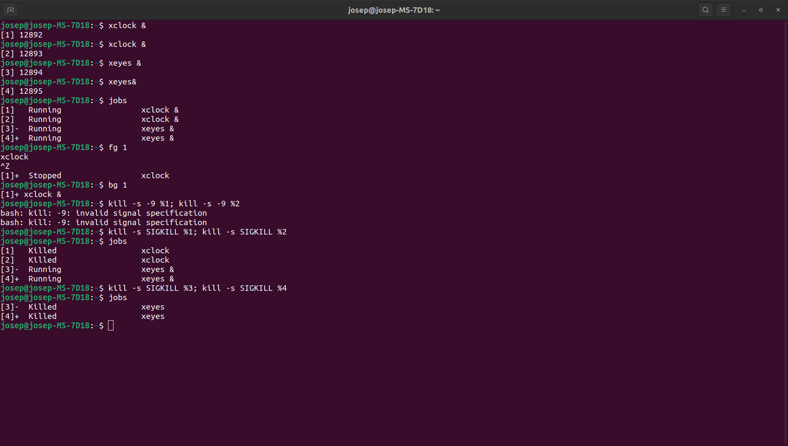

# Fonaments de Xarxes Telemàtiques #
## Pràctiques 1 ##

### Exercisis 2.1 ###
*En aquests exercisis practicareu amb procesos d'execució i señals.*

1. Obre una terminal i executa el comandament per a veure el manual del *ps*. Busca i compta el numero de vegades que apareix el patro *pidd*.


> execuat el comandament [man ps] y el shortcut [/ppid], s'han compat un total de 8 vegades el patró ppid.(afegint aquells que estaben en mayúscula). 

2. Amb la mateixa terminal, executa *ps* amb els paràmetres apropiats per a veure el PID, el *tty* y el el comandament del actuals procesos actius que  han estat executats en aquesta terminal. Fes el mateix en el número de consola virtual dos (/dev/tty).


> executan el mateix codi en la consola virtual ens queda tal que:

> $ ps -a

3. Executa el següents comands:

```c
$ ps -o pid,comm
$ ps -o pid,cmd
```


Comenta les diferències entre les opcions: *cmd* i *comm*.

>Aparentment, el comandament "ps", amb el parametre "comm" indica junt amb el PID, el nom del proces. A diferencia d'aquest, el paramtre "comm" afegeix al nom els parametres que s'han executat junt amb ell (el process).

4. Utlitiza el comandament *pstree* per veure el arbre de procesos del sistema. Quin proces és el pare del *pstree*. I el seu avi? I qui son la resta de relatius?


> el pare de la funció *pstree* és la *bash* i el avi és la funció *gnome-terminal*, és a dir la terminal. Els processos relatius dintre de l'avi s'on procesos executat d'altres terminals. 

5. Obre una terminal secundaria i llavors obre una altra amb "TAB" teclejant CRL+SHIFT+t. Ara, obre una altra terminal secundaria en una nova finestra. Utilitzant el *pstree*, has de comentar la relació entre els diferents procesos executats en les diverses terminals. 


6. Tecleja ALT+F2 i llavors tecleja *xterm*. Fixat que aquesta seqüencia obre un nou tipus de terminal. Repeteix la mateixa seqüencia per a obrir un nou *xterm*. Ara, mira el arbre de procesos y comenta les diferencies respecte als anteriors casos de les terminals secundaries.


>Respecte les anterior, en aquesta, el proces *xterm* que obre una terminal externa o fa a trabes de la señal *gnome-shell*.

7. Obre 3 terminals secundaries. Aquestes s'han d'anomenar tal que *t1*, *t2*, t3*. Llavors, tecleja el següent codi:

```c
t1$ xeyes -geometry 200x200 -center red
t2$ xclock &
```


Comenta que es lo que veus i ademes quin es el tipus de execusió (frontal/fonda) en cada terminal. 

> la primera linia de comandament exectua un sencill proces, *uns ulls que següeixent el cursor*. L'altre linea de comandament executa una proces que ens mostra un rellotge analógic. El primer proces d'exeuta de forma frontal (*foreground*) y el segon de fondo (*background*). 

8. Per a cada proces de les aplicacions previes (*xeyes* i *xclock*), intenta descobrir el PID, l'estat d'execució, el *tty* i el PPID. Per a dur a terme aixó, utilitza la terminal (t3).


9. Utilitzant la tercera terminal (t3), envia una señal per acabar el proces xeyes.


10. Tecleja *exit* en la terminal *t2*. Desprès d'aixó, troba qui és el pare del proces *xclock*.


11. Ara envia una señal per a finalitzar el proces *xclock* fent servir el seu PID.


12. Executeu un *xclock* en format frontal en la primera terminal t1.


13. Envia una señal des de la tercera terminal per a parar el proces *xclock* i llavors un altre señal per a deixar que aquest proces continui executant-se. El proces s'esta executant de fondo o de front? Finalment, enviar una señal per a finalitzar el proces *xclock*.


>La señal continua executant-se de fondo

14. Fent servir el *job control*, repeteix els mateixos pasos que abans, que són: executar el *xclock* de front i parar-lo, arrancar-lo y finalitzar-lo. Enumera els comandaments i les combinacions clau que has utilitzat.

        $ xeyes &
        $ fg 1
        ^Z
        $ kill -s SIGCONT %1
        $ fg 1
        ^C


15. Executa els següents comandaments en una terminal: 

```c
$ xclock &
$ xclock &
$ xeyes &
$ xeyes &
```

Utilitzant el *job control* pasa al primer *xclock* de front. Llavors mou-lo al fondo. Finalitza amb el nom els dos procesos *xclock* i llavors els procesos *xeyes*. Enumera els comandaments i les combinacions clau que has utilitzat.



16. Crea una línea de comandament fent servir una execució de multiples comandaments que mostrin els procesos oberts des de la terminal, llavors espera 3 segons i finalment mostra un altre vegada els procesos obers des de la terminal. 


17. Utlitzant multiples comandaments d'execució (&&, ||, etc,) crea una línea de comandament que executi un comandament *ps* amb un infructuós estat de sortida i llavors un altre comandament *ps* sense paràmetres.


18. Comenta els resultat del següent multiple execució de comandaments: 

```c
$ sleep || sleep || ls
$ sleep && sleep --help || ls && ps
$ sleep && sleep --help || ls || ps
```

> En la ptimera linea de comandaments, ha agut error a l'hora de intentar trobar el cmd *sleep*. tot i així, ha pugut exectuar el process *ls*. En la següent ha seguit executat les respostes corresponents, amb l'excepció que els proces *sleep --help* no s'ha pogut executar per culpa dels &&. Finalment, per culta dels simbol ||, solament s'ha executat el primer proces escrit en la línea de comandaments.

### Exercisis 2.2 ###
*Aquests exercisis tracten amb aspectes adicionals sobre procesos*

1. Crea un script que demani per un numero i retorni el numero multiplicat per 7. Nota: si utlitzes la variable VAR per a llegir, pots utlitzar $[VAR * 7] per retornar el multiplicat.

2. Afegeix una señal administrativa al script anterior que quan la señal USR1 es rebuda, el script imprimeixi la frase "esperant operador".

**Consell: Utilitza** *trap* **per a conseguir la USR1 i** *kill -USR1 PID* **per a enviar aquesta señal.**

3. Tecleja el comandament per a executar l'aplicació *xeyes* de fondo amb un "niceness" (prioritat) equivalent a 18. Llavors, tecleja el comandament per a veure el comandament, el PID i la prioritat del proces *xeyes* que acabes d'executat.