# Fonaments de Xarxes Telemàtiques #
## Pràctiques 3 ##

### Exercisis 3.1 ###
*Aquests exercisis tracten del Linux filesystem i els seus permisos de sistema*

1. Obre una terminal i explora el teu directori *home* (tecleja *cd ~* o simplement *cd*). Llavors, tecleja el tipus de comandament que utilitzant una ruta relativa cambii la teva localització a la del directori /etc.

        $ cd ~

        $ pwd

        $ ls /

        $ ../../../etc

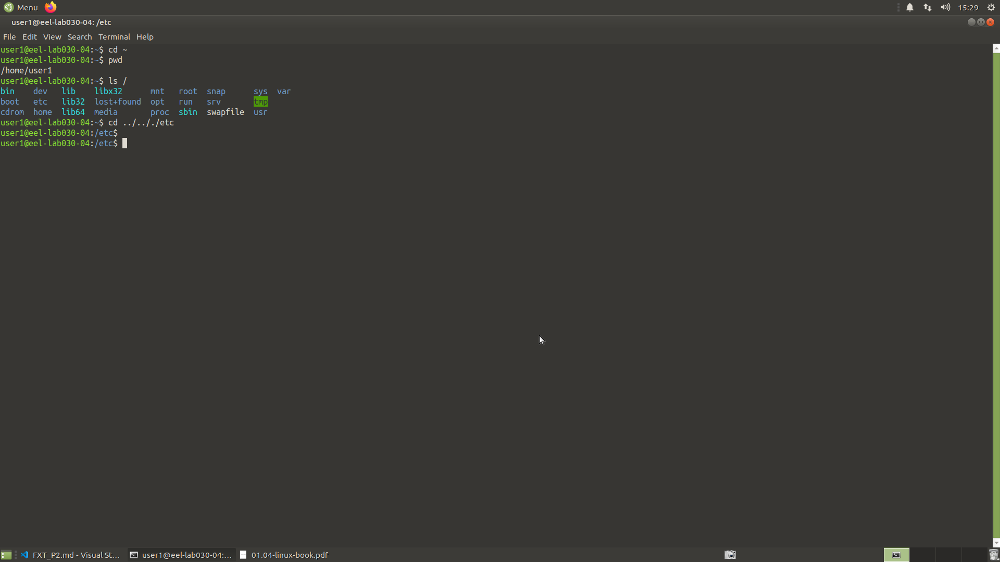

2. Tecleja el comandament per tornar la directori *Home* utilitzant la ruta absoluta. 

        $ cd ~

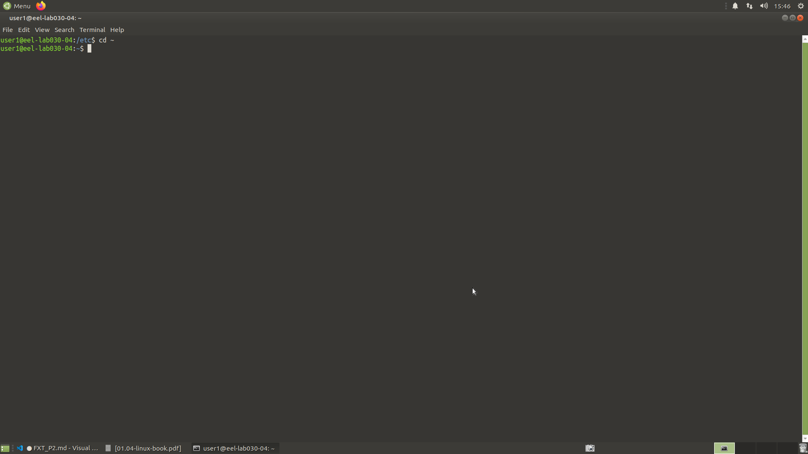

3. Una vegada en el teu directori *home*, tecleja el comandament per copiar el archius /etc/passwd en el teu directori de treball utilitzant unicament les rutes relatives.

        $ cp ../../../etc/passwd passwdCopy

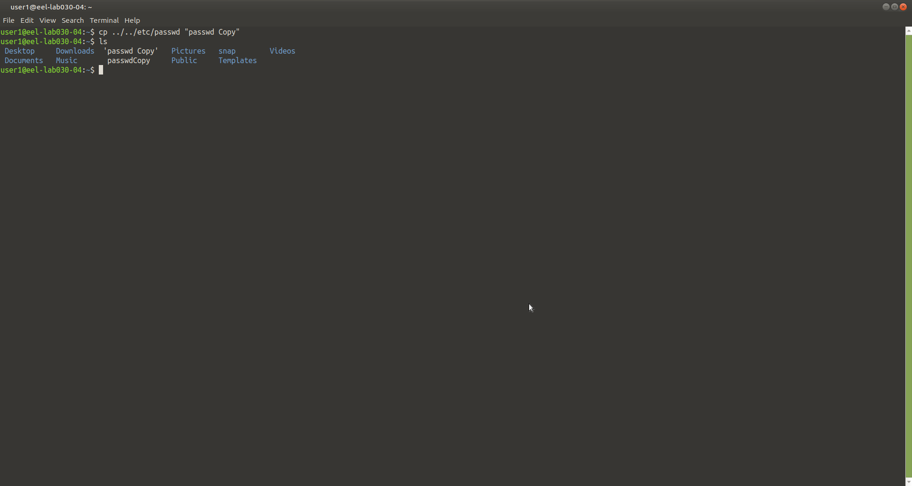


4. Crea 6 directoris que s'anomenin: dirA1, dirA2, dirB1, dirB2, dirC1 i dirC2 dintre del teu directori *home*. Tu pots fer-ho amb els següents comandaments:

```c
$ mkdir dirA1 dirA2 dirB1 dirB2 dirC1 dirC2
```

O utilitzant la funionalitat anomenada "brace expansion":

```c
$ mkdir dir{A,B,C}{1,2}
```

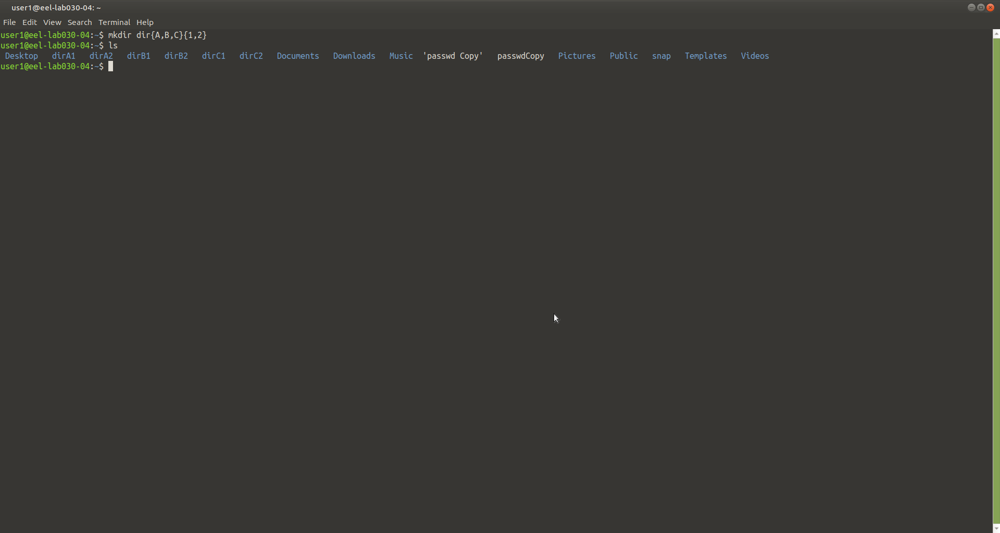

5. Elinina els directoris dirC2 i dirC1 utilitzant la clau "?".

        $ rmdir ~/dirC?
        $ rmdir ~/dirC[1 2]

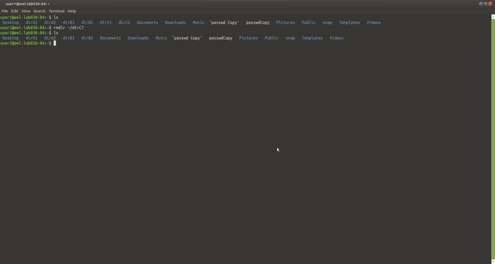

6. Crea un archiu buit en el teu directori de treball que s'anomeni *temp*.

        $ touch temp.txt

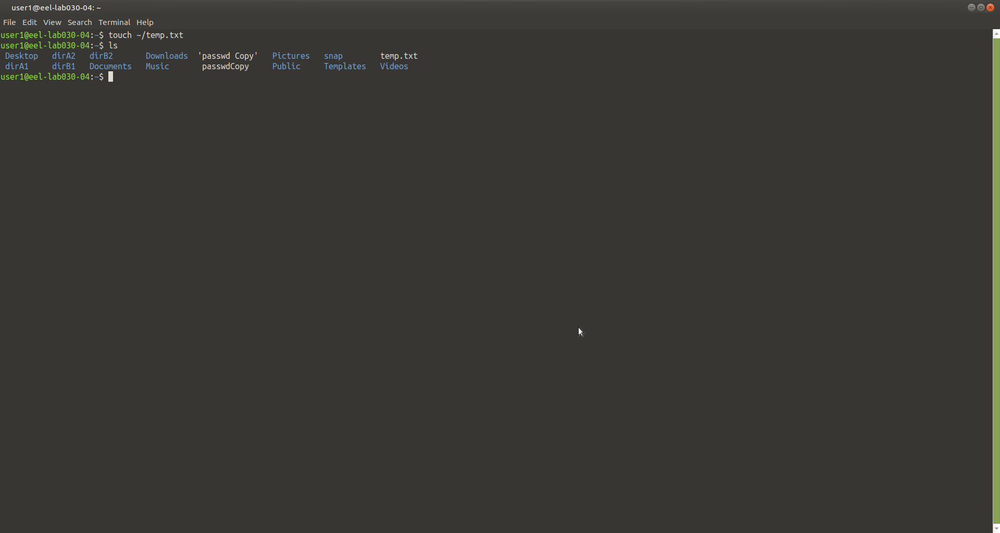

7. Tecleja el comandament per veure text que mostri el contingut del archiu, que obiament esta buit. 

        $ cat temp.txt

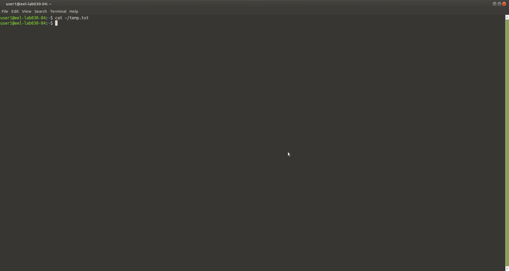

8. Tecleja el comandament per mostrar les dades i propietats del archiu (data de creació, data de modificació, última data d'accés, inode, etc.).

        $ stat temp.txt

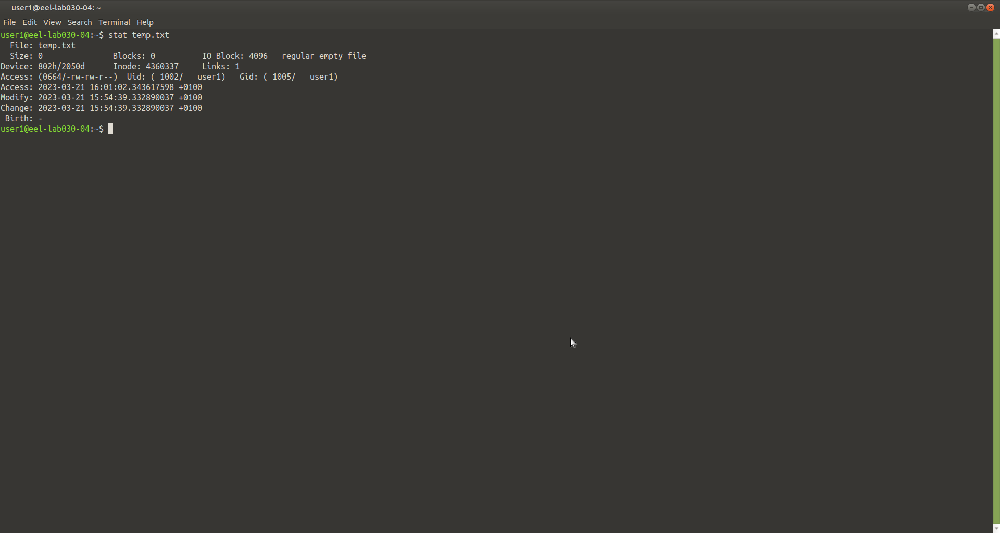

9. Quin tipus de contingut es mostra en el archiu *temp*? Quin tipus d'archiu bàsic és?

> El tipus d'archiu temp.txt es un "Regular Empty File" de format ".txt".

10. Cambia el teu directori de treball. Des de allí, tecleja el comandament per a probar de copiar el archiu *temp* al directori /usr. Que és lo que pasa i perquè?

        $ mkdir exercise10
        $ cd exercise10
        $ cp ../temp.txt c/usr/tempCopy.txt

> El proces no s'arriba a executar, perque no tenim permisos per a escriure un archiu del directori *home* des del directori creat per el nostre usuari.

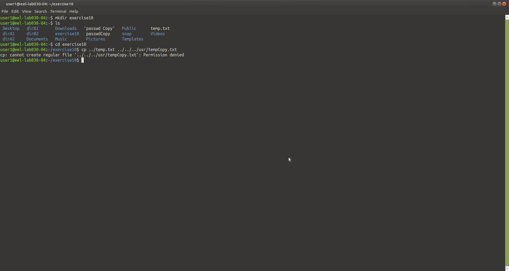

11. Crea un directori que s'anomeni *practices* dintre del *home*. Dintre de *practices*, crea dos directoris mes que s'anomenin *with_permission* i *without_permission*. LLavors, borra el teu propi permis d'escriptura en el directori *without_permission*. 

        $ cd ~
        $ mkdir practices
        $ cd practices
        $ mkdir with_permission, without_permission
        $ chmod u-w /without_permission

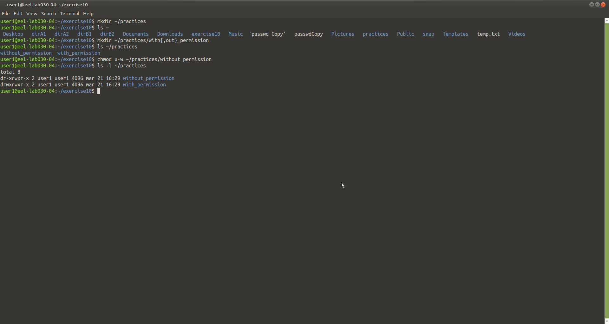

12. Intenta copiar el archiu *temp* als dos directoris anteriors. Explica que es lo que succeeix en cada cas i perquè?

        & cp temp.txt with_permission/tempCopy.txt, without_permission/tempCopy.txt

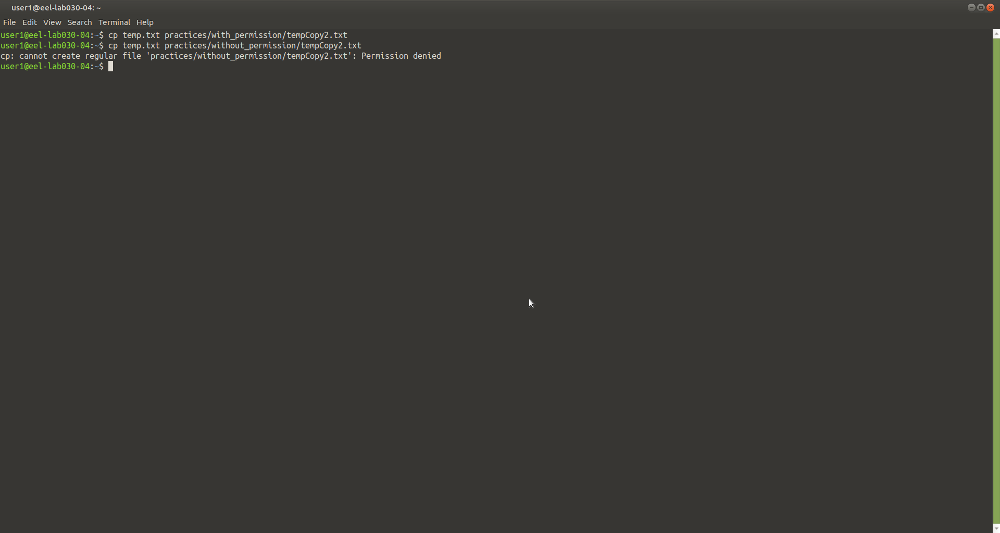

13. Adivina quin es el mínim nivell permes que te el propietari (llegir, escriure, executar) per a poder executar els següents comandaments: 

|Commands|read|write|execute|
|:-:|:-:|:-:|:-:|
|cd without_permission|||+|
|cd without_permission; ls -l|+|||
|cp temp ~/practices/without_permission||+||

        $ ls -l ./practices

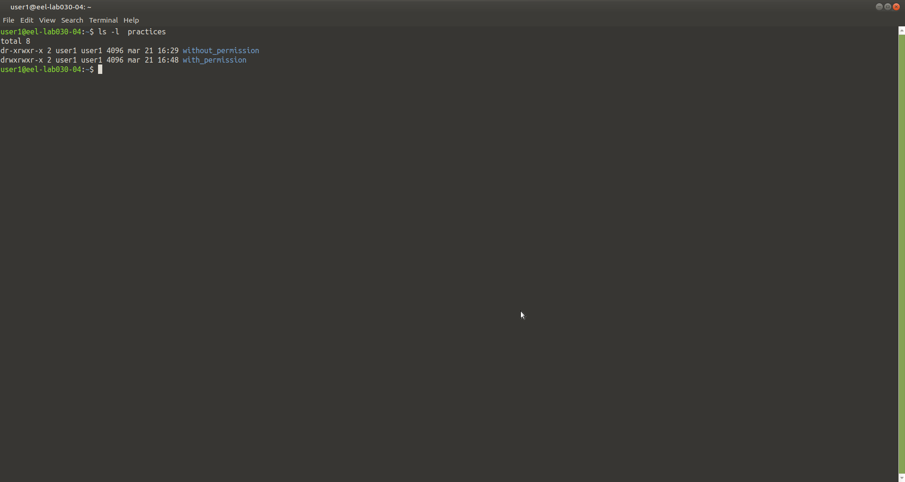

### Exercisis 3.2 ###
*Aquests execisis representen pràctiques sobre archius de text i archius especials*

1. Crea un archiu que s'anomeni orig.txt amb el comandament *touch* i utilitza el comandament *ln* per a crear  un enllaç simbólic del archiu que s'anomeni link.txt. Obre el editor de text *vi* i modifica el archiu orig.txt escribint algo de text.

        $ touch orig.txt
        $ ln -s orig.txt link.txt
        $ vi orig.txt
        
        "fer servir 'i' per insetar el contingut i despres ESC per sortir del mode d'insersió"

2. Utilitza el comandament *cat* per veure el link.txt. Que es lo que pots veure? Perquè?

        $ cat link.txt

3. Repeteix els pasos anterior pero aquesta vegada modifica primer el archiu link.txt i llavors observa el archiu org.txt. Comenta el resultat.

4. Borra tots els permisos del archiu orig.txt i proba de modificar el archiu link.txt. Que es lo que pasa?

        $ chmod 000 orig.txt
        $ vi link.txt

5. Retorna els permisos al archiu orig.txt. Lavaros, proba de borra els permisos escrits en el link.txt. Tecleja *ls -l* i comenta els resultats. 

        $ chmod 777 orig.txt
        $ chmod 000 link.txt
        $ ls -l ~

6. Elimina el archiu orig.txt i proba de mostar el contingut del link.txt amb el comandament *cat*. Llavors, en la terminal (t1) edita orig.txt amb el comandament:

        $ rm orig.txt
        $ cat link.txt
```c
t1$ vi orig.txt
```

mentre l'editor estigui obert, tecleja el següent codi en un altre terminal (t2):

```c
t2$ echo hello > link.txt
```

7. Utilitza el comandament *stat* per veure el numero de enllaços del archiu orig.txt i el archiu link.txt que tens.

        $ stat *.txt

8. Ara crea un enllaç dur per la archiu orig.txt que s'anomeni hard.txt. Llavors utilitza el comandament *stat* per adonar-te'n compte que el número de "Enllaços" dels archius orig.txt i hard.txt.

        $ ln orig.txt hard.txt
        $ stat orig.txt; stat hard.txt

9. Elimina el ficher orig.txt i proba de modificar amb el comandament *vi* el hard.txt. Que es lo que pasa?

        $ rm orig.txt
        $ vi hard.txt

10. Utilitza el comandament *grep* per trobar l'informació sobre el protocol HTTP present en el ficher /etc/services (recorda que esl comandaments Unic son "case-sensitive"). 

        $ grep bash /etc/services

11. Utilitxa el comandament *cut* sobre el archiu /etc/group per mostrar el nom de cada grup i els seus membres (últim cap). 

        $ cut -d "." /etc/group

12. Crea un archiu buit que s'anomeni text1.txt. Utilitza el editor de text *vi abn* per introduir "abñ" en el archiu, guardar-lo i sortir. Tecleja un comandament per adivinar el tipus de contingut del ficher. 

        $ touch text1.txt
        $ vi text1.txt
        "Insert abñ"
        $stat text1.txt

13. Busca en la Web el codi hexadecimal de la letra "ñ" en la ISO-889-15 i la UTF8. Utilitza el comandament *hexdump* per veure el contingut hexadecimal del archiu text1.txt. Quin tipus de codi t'has trobat?

        $ hexdump text1.txt

14. Busca quin caracter és el "0x0a", que ademés apareix en el ficher. 

        "consultar taules UTF-8"

15. Obre un *gedit* editor de text i tecleja "abñ". Ves al menú i utlitza l'opció "Save as" per a guardar el archiu amb el nom text2.txt i "Line Ending" de tipus Windows. Altre vegada amb el comandament *hexdump* examina el contingut del archiu. Busca quin tipus de caràcter esta codificat com a "0x0d".

```c
$ hexdump text2.txt
0000000 6261 b1c3 0a0d
0000006
```

16. Explica la diferencia entre els tipus de línies de ruptura per Unix (nou Mac), Windows i el Mac clàsic. 

17. Obre un editor de text *gedit* i tecleja "abñ". Ves al menú i utlitza l'opció "Save as" per a guardar el archiu amb el nom text3.txt i "character Encoding" ISO-8859-15. Revisa el contingut del archiu de text amb el comandament *hexdump* i comenta el resultat. 